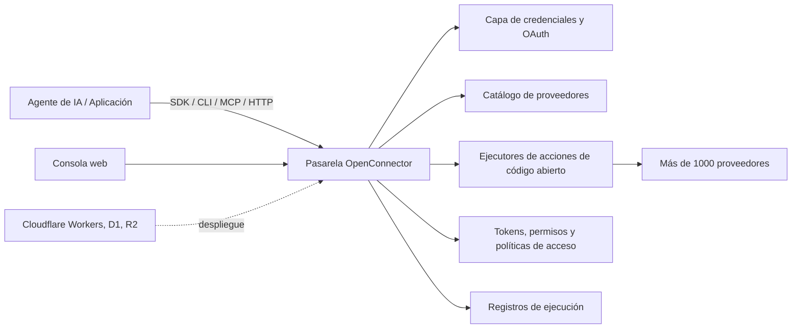
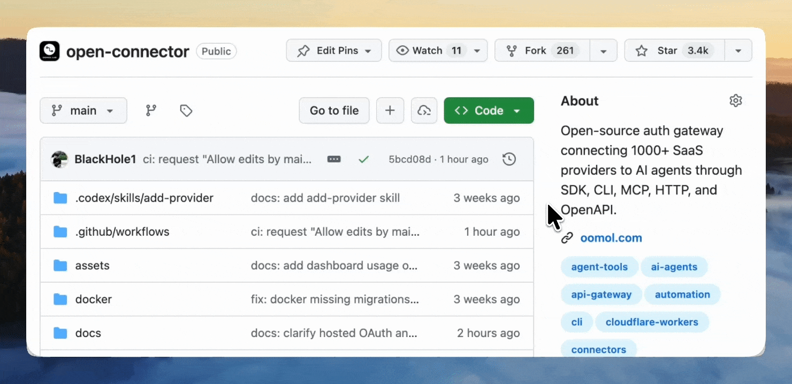
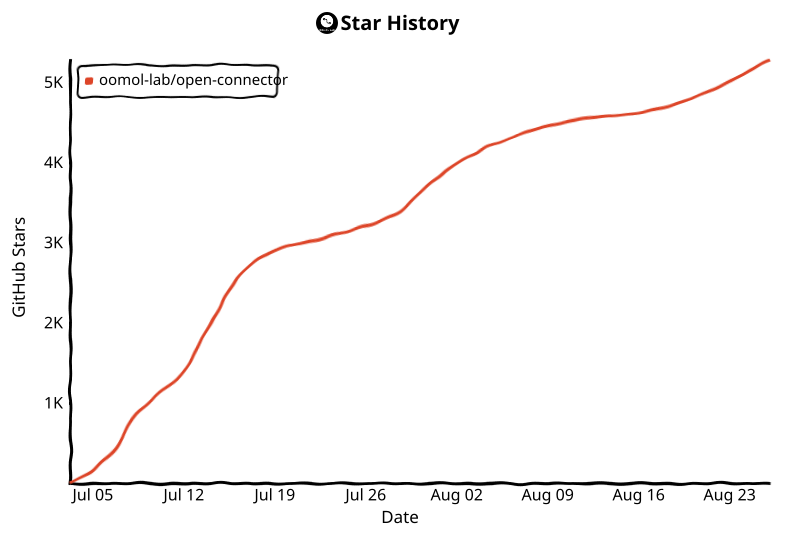

<div align="center">


[English](../README.md) | [简体中文](README.zh-CN.md) | [繁體中文](README.zh-TW.md) | [日本語](README.ja.md) | [한국어](README.ko.md) | [Русский](README.ru.md) | [Français](README.fr.md) | [Español](README.es.md)

[](../LICENSE.txt)


[](https://oomol.com/apps)
[](https://oomol.com/apps)

</div>

OpenConnector es una pasarela de conectores de código abierto para agentes de IA y una alternativa a Pipedream/Composio.
Conecta una sola vez las cuentas de las aplicaciones de los usuarios y ofrece a los agentes y las aplicaciones
un catálogo compartido de más de 1000 proveedores y más de 10 000 acciones predefinidas.

<table>
  <tr>
    <td width="33.33%" align="center"></td>
    <td width="33.33%" align="center"></td>
    <td width="33.33%" align="center"></td>
  </tr>
  <tr>
    <td width="33.33%" valign="top">OAuth gestionado y entorno de ejecución alojado, listos para usar. Sin despliegues ni configuración de aplicaciones OAuth.</td>
    <td width="33.33%" valign="top">Ejecuta OpenConnector en local o en tu propia infraestructura con Docker o Node.js. Tú gestionas el almacenamiento y las aplicaciones OAuth.</td>
    <td width="33.33%" valign="top"><strong>Cloudflare</strong>, <strong>Fly.io</strong>, <strong>RepoCloud</strong>, <strong>nibrun</strong> y más.</td>
  </tr>
  <tr>
    <td width="33.33%" align="center">🚀 <a href="https://oomol.com/docs/connector-saas/"><strong>Alojado en OOMOL</strong></a></td>
    <td width="33.33%" align="center"><a href="https://oomol.com/docs/openconnector-self-hosting/"><strong>Alojamiento propio</strong></a></td>
    <td width="33.33%" align="center"><a href="deployment-options/"><strong>Más plataformas</strong></a></td>
  </tr>
</table>

Usa el [Connector SDK](https://github.com/oomol-lab/connector-sdk) desde el código de tu aplicación,
[oo CLI](https://github.com/oomol-lab/oo-cli) como intermediario para agentes locales, MCP desde plataformas
que ejecutan agentes, HTTP/OpenAPI desde clientes personalizados y la consola web para administrar y depurar.

- Mantén las credenciales, los permisos, los esquemas, las políticas y los registros de ejecución en un entorno que puedas inspeccionar.
- Ejecuta el servicio en local, en tu propia infraestructura o en el entorno alojado de OOMOL.
- Usa los mismos identificadores de proveedores y acciones, esquemas y contratos en los despliegues de código abierto y de SaaS comercial.

## Qué ofrece

- Un catálogo funcional de conectores para productos como GitHub, Gmail, Notion, BigQuery, Google Analytics, Supabase, Airtable, Slack y más.
- Gestión de claves de API, OAuth2, credenciales personalizadas y proveedores sin autenticación.
- Contratos de acciones que puedes inspeccionar: esquemas de solicitud y respuesta, permisos requeridos y código fuente de los ejecutores con carga diferida.
- Controles del entorno de ejecución para la identidad de las conexiones, los permisos, los tokens de acceso, las políticas para permitir o bloquear acciones, la transferencia temporal de archivos y los registros con datos sensibles ocultos.
- Despliegue local con Docker o Node.js, estado en SQLite o PostgreSQL y almacenamiento temporal de archivos local o compatible con S3, además del entorno alojado de OOMOL. Consulta otras plataformas gestionadas en las [opciones de despliegue](deployment-options/).

## Para quién está pensado

OpenConnector encaja en productos cuyos agentes necesitan acceso duradero a las herramientas que los usuarios
ya utilizan, sin entregar las credenciales de los proveedores al proceso del agente.

- Productos de agentes que necesitan acceso reutilizable a aplicaciones de trabajo, herramientas de desarrollo, sistemas de datos, plataformas de comunicación y servicios de IA.
- Productos que incorporan flujos de trabajo con agentes y necesitan contratos de acciones estables e inspeccionables para acceder a las aplicaciones de los usuarios.
- Equipos que buscan autenticación alojada para avanzar con rapidez y quieren conservar la posibilidad de controlar un entorno de ejecución privado o en su propia infraestructura.

## Herramientas para desarrolladores

| Herramienta                                                 | Finalidad                                                                                                                                                                                                           |
| ----------------------------------------------------------- | ------------------------------------------------------------------------------------------------------------------------------------------------------------------------------------------------------------------- |
| [Connector SDK](https://github.com/oomol-lab/connector-sdk) | Cliente HTTP ligero para TypeScript. Usa `OpenConnector` para entornos en tu propia infraestructura, o `Connector` / `ProjectConnector` para conexiones personales y de usuarios finales de SaaS alojadas en OOMOL. |
| [oo CLI](https://github.com/oomol-lab/oo-cli)               | Intermediario de acciones de conectores para agentes locales. `oo connector` permite buscar, inspeccionar y ejecutar acciones en entornos de OOMOL o de OpenConnector en tu propia infraestructura.                 |
| MCP                                                         | Expone acciones de aplicaciones a plataformas de agentes compatibles con MCP mediante `http://localhost:3000/mcp`.                                                                                                  |
| HTTP / OpenAPI                                              | Permite llamar directamente a `/v1/actions/*` o consultar el documento generado `/openapi.json`.                                                                                                                    |

Consulta los detalles de los endpoints, las estructuras de respuesta, las cabeceras de autenticación,
las herramientas MCP y los ejemplos de guías de acciones en [docs/runtime-api.md](runtime-api.md).

## Vista previa del panel

OpenConnector incluye un panel local para explorar conectores, configurar credenciales,
crear tokens del entorno de ejecución e inspeccionar su uso.

### Catálogo de conectores

Usa el catálogo para ver los servicios disponibles, buscar proveedores y acceder a sus acciones
y a la configuración de credenciales desde un solo lugar.


### Resumen de uso

Después del despliegue, usa la página Overview para supervisar el estado del entorno de ejecución,
los proveedores disponibles, las acciones ejecutables, los errores recientes, las tendencias de llamadas
a herramientas y las últimas llamadas.


Los nombres y las marcas de los proveedores pertenecen a sus respectivos titulares y se utilizan
únicamente con fines de identificación e interoperabilidad.

## Cómo funciona



Las aplicaciones y los agentes descubren acciones, inspeccionan esquemas y permisos, seleccionan un alias
de conexión y ejecutan las acciones a través de la pasarela. Los secretos de los proveedores permanecen
dentro del entorno de ejecución; los agentes reciben los metadatos, las etiquetas de cuenta seguras y
los resultados que necesitan para la ejecución.

## Modalidades de uso

| Modalidad                                                    | Ideal para                                                              | Incluye                                                                                                                                                                                                                                                       |
| ------------------------------------------------------------ | ----------------------------------------------------------------------- | ------------------------------------------------------------------------------------------------------------------------------------------------------------------------------------------------------------------------------------------------------------- |
| Código abierto en tu propia infraestructura                  | Desarrolladores y equipos que quieren control total                     | Entorno local con Docker o Node.js, estado en SQLite o PostgreSQL, archivos temporales locales o compatibles con S3, MCP, HTTP, OpenAPI y consola web                                                                                                         |
| [Kubernetes (Helm)](../deploy/helm/open-connector/README.md) | Equipos que gestionan sus propios clústeres                             | Chart de Helm con seguridad reforzada, SQLite respaldado por PVC o PostgreSQL, hooks de migración, Ingress, escalado automático y opciones de NetworkPolicy                                                                                                   |
| [OOMOL](https://oomol.com/apps)                              | Equipos que quieren que los usuarios autoricen sus cuentas de inmediato | Aplicaciones OAuth proporcionadas por OOMOL, créditos de Connect incluidos cada mes e infraestructura de ejecución alojada; los mismos contratos de proveedores y acciones permiten pasar más adelante a un despliegue privado o en tu propia infraestructura |

## Inicio rápido

> [!NOTE]
> Este procedimiento inicia un entorno en tu propia infraestructura. Los proveedores OAuth requieren
> credenciales de cliente OAuth de aplicaciones que registres con esos proveedores. Para que los usuarios
> autoricen proveedores compatibles sin configurar tus propias aplicaciones OAuth, usa los
> [conectores alojados en OOMOL](https://oomol.com/apps).

Inicia el entorno desde la imagen publicada con Docker Compose:

```bash
docker compose up
```

Esto descarga `ghcr.io/oomol-lab/open-connector:latest`. Para compilar desde el código fuente:

```bash
docker compose -f docker-compose.yml -f docker-compose.build.yml up --build
```

Abre la consola local y la referencia de API generada:

```text
http://localhost:3000
http://localhost:3000/docs
```

Ejecuta una acción sin autenticación para comprobar el funcionamiento:

```bash
curl -s -X POST http://localhost:3000/v1/actions/hackernews.get_top_stories \
  -H 'content-type: application/json' \
  -d '{"input":{}}'
```

Consulta [docs/quickstart.md](quickstart.md) para ver la configuración local completa, la primera
conexión con un proveedor, el flujo OAuth y los ajustes del entorno de ejecución.

## Conectar un proveedor

GitHub es el ejemplo más sencillo con credenciales porque admite un token de acceso personal:

```bash
curl -s -X PUT http://localhost:3000/api/connections/github \
  -H 'content-type: application/json' \
  -d '{"authType":"api_key","values":{"apiKey":"github_pat_..."}}'

curl -s -X POST http://localhost:3000/v1/actions/github.get_current_user \
  -H 'content-type: application/json' \
  -d '{"input":{}}'
```

Para obtener información sobre aplicaciones OAuth2, conexiones con nombre, cifrado de credenciales,
renovación de tokens y políticas de acciones, consulta [docs/credentials.md](credentials.md) y
[docs/configuration.md](configuration.md).

## Consola web

Para el desarrollo local con npm, abre `http://localhost:5173`; el servidor de desarrollo de la consola
web reenvía las solicitudes de API al entorno de ejecución en `http://localhost:3000`. Con Docker o
un entorno de Node.js ya compilado, la consola se sirve desde `http://localhost:3000`.

La consola permite explorar proveedores, configurar claves de API y clientes OAuth, crear tokens del
entorno de ejecución, inspeccionar esquemas de acciones, depurar acciones, revisar ejecuciones recientes
y acceder a los metadatos generados de OpenAPI y MCP.

## Almacenamiento del entorno de ejecución en PostgreSQL

El entorno de Node.js usa SQLite de forma predeterminada y puede usar PostgreSQL 15 o posterior al
configurar `OOMOL_CONNECT_DATABASE_URL`. Las migraciones de PostgreSQL son explícitas: ejecuta
`npm run runtime:migrate` antes de iniciar una versión con migraciones pendientes. Al arrancar, el servidor
solo comprueba que el esquema esté listo y nunca aplica DDL de PostgreSQL. Consulta
[docs/configuration.md](configuration.md#runtime-database) para conocer la configuración, los permisos,
TLS y los requisitos para varias instancias. La imagen de Docker ofrece el mismo ejecutor mediante
el subcomando `migrate`; consulta [docs/docker-ghcr.md](docker-ghcr.md#postgresql-migrations).

## Imagen de Docker (GHCR)

Ejecuta OpenConnector desde una imagen precompilada de GitHub Packages (GHCR):
`ghcr.io/oomol-lab/open-connector`. Usa `latest` para la versión publicada más reciente, una versión
publicada fija para producción o `tip` para la compilación más reciente de `main`.

Consulta [docs/docker-ghcr.md](docker-ghcr.md) para conocer las etiquetas y cómo descargar y ejecutar la imagen.

## Crear un agente de escritorio con Wanta

OpenConnector y [Wanta](https://github.com/oomol-lab/wanta) son dos proyectos de código abierto para agentes
de IA del ecosistema OOMOL. OpenConnector conecta a los agentes con servicios externos como Gmail,
Slack y Notion. Wanta ofrece una aplicación completa de agente de escritorio basada en OpenCode y utiliza
OpenConnector para trabajar con servicios SaaS conectados.

- **Ejecución local:** Usa tu propio modelo compatible con OpenAI sin crear una cuenta de Wanta.
- **Crea tu propia versión:** Haz un fork de Wanta y personaliza sus prompts, herramientas, interfaz, modelos e identidad de marca.
- **Servicios alojados:** La [experiencia alojada](https://wanta.ai/), opcional, ofrece modelos gestionados, conexiones OAuth y espacios de trabajo para equipos.

Las incidencias y las pull requests son bienvenidas.

## Documentación

- [Inicio rápido](quickstart.md)
- [Herramientas para desarrolladores](sdk-cli.md)
- [Gestión programática de conexiones](programmatic-connections.md)
- [Tutorial de OAuth de Gmail y SDK](gmail-oauth-sdk.md)
- [OAuth y acciones de Instagram](instagram-oauth.md)
- [API del entorno de ejecución y MCP](runtime-api.md)
- [Opciones de despliegue](deployment-options/)
- [Despliegue en Fly.io](fly-io.md)
- [Despliegue en Cloudflare](cloudflare.md)
- [Imagen de Docker (GHCR)](docker-ghcr.md)
- [Binario único](single-binary.md)
- [Configuración](configuration.md)
- [Credenciales y OAuth](credentials.md)
- [Formato del catálogo](catalog-format.md)
- [Terminología de verificación](verification.md)
- [Cómo contribuir](../CONTRIBUTING.md)
- [Código de conducta](../CODE_OF_CONDUCT.md)
- [Seguridad](../SECURITY.md)

## Desarrollo

Usa Node.js 22 o posterior:

```bash
npm install
npm run dev
```

La API local escucha en `http://localhost:3000`. El servidor de desarrollo de la consola web escucha
en `http://localhost:5173` y reenvía las solicitudes de API al entorno de ejecución.

Antes de abrir una pull request:

```bash
npm run fix-check
npm test
```

El código de los proveedores se encuentra en `src/providers/<service>`. Consulta
[CONTRIBUTING.md](../CONTRIBUTING.md#adding-providers) para conocer las reglas de contribución de proveedores.

## Alcance de la licencia

Salvo que se indique lo contrario, el código fuente, los scripts, las estructuras de proyecto generadas,
las pruebas y la documentación creados para este repositorio se distribuyen bajo la licencia Apache,
versión 2.0. Consulta [LICENSE.txt](../LICENSE.txt).

La licencia Apache-2.0 de este repositorio no concede derechos sobre productos, proveedores,
aplicaciones, API, marcas comerciales, marcas de servicio, nombres comerciales, logotipos, iconos,
recursos de marca, documentación, capturas de pantalla ni otros materiales protegidos por derechos
de autor que pertenezcan a terceros.

Los nombres de proveedores y aplicaciones, los metadatos, los enlaces, los ámbitos de autorización,
los permisos y los logotipos o iconos opcionales se incluyen únicamente para identificar servicios y
permitir la interoperabilidad. Todos los derechos de marca y producto de terceros siguen perteneciendo
a sus respectivos titulares. La inclusión en este catálogo no implica respaldo, patrocinio, asociación,
certificación ni verificación por parte de dichos titulares.

Si contribuyes con metadatos o recursos de proveedores, envía únicamente material que tengas derecho
a aportar. Es preferible enlazar a recursos públicos oficiales en lugar de copiar archivos de marca
en este repositorio.

## Comunidad

Procura que las incidencias y las pull requests sean concretas, respetuosas y permitan actuar.
La participación en este proyecto se rige por [CODE_OF_CONDUCT.md](../CODE_OF_CONDUCT.md).

## Apoya a OpenConnector

Si OpenConnector te resulta útil, darle una ⭐ ayuda a que más desarrolladores descubran el proyecto.

<div align="center">



</div>

## Colaboradores

Gracias a todas las personas que han ayudado a crear OpenConnector. ¿Quieres participar? Consulta
[CONTRIBUTING.md](../CONTRIBUTING.md).

[](https://github.com/oomol-lab/open-connector/graphs/contributors)

## Historial de estrellas

<!-- star-history:start -->
<picture>
  <source media="(prefers-color-scheme: dark)" srcset="../assets/star-history/star-history-dark.svg">
  
</picture>
<!-- star-history:end -->
