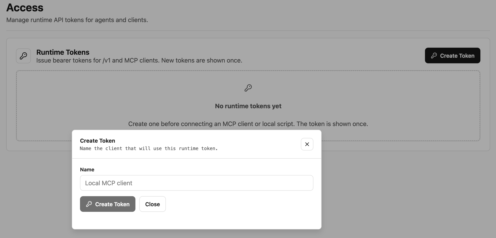

# Gmail OAuth And SDK Tutorial

This tutorial uses a **local OAuth client**. For a SaaS-managed Gmail account, configure its project and provider config first, then use the standard connection request endpoints with no client override. Tokens and execution stay on SaaS; reconnect preserves the saved source. See [SaaS OAuth](saas-oauth.md) and [programmatic connections](programmatic-connections.md).

This guide starts after you already have a Gmail OAuth client. It does not cover creating or
configuring the OAuth app in Google Cloud. OpenConnector only needs the resulting client id, client
secret, and a redirect URI that the OAuth app allows.

## Prerequisites

- The local OpenConnector runtime can run with Node.js 22 or newer.
- You have a Gmail OAuth `clientId` and `clientSecret`.
- The Gmail OAuth app allows this runtime's redirect URI. The URI is the current runtime origin plus
  `/oauth/callback`.

If the runtime is reachable through a tunnel or another public origin, set `OOMOL_CONNECT_ORIGIN`
before starting it. The redirect URI is derived from that origin by appending `/oauth/callback`.

```bash
OOMOL_CONNECT_ORIGIN="https://your-runtime.example" npm run dev
```

For plain local development, start the runtime normally:

```bash
npm install
npm run dev
```

The examples below use `http://localhost:3000`. If you configured
`OOMOL_CONNECT_ADMIN_TOKEN` or a runtime token, add the matching `Authorization: Bearer ...` header
to admin and `/v1` requests.

OAuth redirect URI is shared by all services in the same runtime. Configure the Gmail OAuth app to
allow the current runtime origin plus `/oauth/callback`. With the default local origin, the redirect
URI is:

```txt
http://localhost:3000/oauth/callback
```

## 1. Store The Gmail OAuth Client

Open the local console at `http://localhost:3000`, open the Gmail provider page, and choose
**Configure OAuth Client**. Paste the Gmail OAuth `clientId` into **Client ID**, paste the
`clientSecret` into **Client Secret**, then choose **Save OAuth Client**.


After saving, the Gmail provider page should allow you to start the connection flow.

## 2. Authorize A Gmail Account

After the OAuth client is configured, the Gmail provider page shows **Connect Gmail**. Choose that
button to start the OAuth authorization flow.


Finish consent in the browser. After Gmail redirects back to the runtime, OpenConnector stores the
OAuth credential as the default Gmail connection.

After the callback completes, the Gmail provider page shows the connected OAuth state.


## 3. Create A Runtime Token

Before calling the runtime from your own code, create a runtime token from the local console. Open
the Access page, choose **Create Token**, name the client, and copy the token when it is shown.



Set the copied token in the shell that runs your app:

```bash
export OOMOL_CONNECT_RUNTIME_TOKEN="oct_..."
```

## 4. Verify Gmail Through HTTP

Run a Gmail Action through the runtime API with the runtime token created above:

```bash
curl -s -X POST http://localhost:3000/v1/actions/gmail.search_threads \
  -H "authorization: Bearer $OOMOL_CONNECT_RUNTIME_TOKEN" \
  -H 'content-type: application/json' \
  -d '{"input":{"query":"newer_than:7d","maxResults":5}}'
```

## 5. Call Gmail From The SDK

Install the SDK in your TypeScript project:

```bash
npm install @oomol-lab/connector
```

Use `OpenConnector` for a self-hosted OpenConnector runtime. `baseUrl` is the server origin, not a
`/v1` URL. Pass the runtime token you created above.

```ts
import { OpenConnector } from "@oomol-lab/connector";

const open = new OpenConnector({
  baseUrl: process.env.OPENCONNECTOR_BASE_URL ?? "http://localhost:3000",
  runtimeToken: process.env.OOMOL_CONNECT_RUNTIME_TOKEN,
});

const { threads } = await open.execute("gmail.search_threads", {
  query: "newer_than:7d",
  maxResults: 5,
});

console.log(threads);
```

The namespace form calls the same Action:

```ts
const { threads } = await open.gmail.search_threads({
  query: "from:someone@example.com",
  maxResults: 5,
});
```

For precise Gmail Action types, install the optional types package and import the Gmail registry once
in the process:

```bash
npm install -D @oomol-lab/connector-types
```

```ts
import "@oomol-lab/connector-types/gmail";
```

## 6. Attach Files And Inline Images

Gmail send, draft creation, and reply actions accept `attachments`. For a CID image, provide a
`contentId` and reference the same value from your HTML. Render Markdown, resolve application assets,
and convert image URLs to CID references in your application before calling the connector.

With `open` from the previous section and local `logo.png` and `report.pdf` files:

```ts
import { readFile } from "node:fs/promises";

const { draftId } = await open.execute("gmail.create_email_draft", {
  to: "recipient@example.com",
  subject: "Report",
  body: '<p>Please see the attached report.</p>',
  isHtml: true,
  attachments: [
    {
      filename: "logo.png",
      mimeType: "image/png",
      contentBase64: (await readFile("./logo.png")).toString("base64"),
      contentId: "logo",
      disposition: "inline",
    },
    {
      filename: "report.pdf",
      mimeType: "application/pdf",
      contentBase64: (await readFile("./report.pdf")).toString("base64"),
    },
  ],
});

await open.execute("gmail.update_draft", { draftId, subject: "Updated report" });
```

The subject-only update of this new-message draft preserves the existing MIME body, attachments,
and inline images. `gmail.send_draft` sends the saved draft as-is.

Each attachment accepts exactly one content source: `contentBase64` or `file: { fileId }` for a
file uploaded through `POST /api/files`. `filename` and `mimeType` can override transit file metadata.
Use a bare `contentId`, without `cid:` or angle brackets. Its presence defaults the disposition to
`inline`; otherwise the default is `attachment`.

For `update_draft`:

- Omit `attachments` to preserve existing files and inline images. A supplied list replaces all of
  them; `attachments: []` removes them. Update HTML references when removing or replacing CID images.
- Omit both `body` and `messageBody` to preserve existing plain-text and HTML alternatives. A supplied
  body replaces those alternatives with one body. Omitting `isHtml` inherits the existing body type
  (HTML when an HTML alternative exists). Pass `isHtml: false` for plain text or `isHtml: true` for HTML.
  An empty body clears it. `isHtml` requires a replacement body.
- Omitted editable headers remain unchanged. An empty subject on a new-message draft or an empty
  recipient field clears that field. Reply subjects must still match the associated conversation.
  Content edits to unsupported or ambiguous MIME structures fail rather than discard content.

The connector accepts at most 100 attachments, 25,000,000 decoded attachment bytes in total, and
35,000,000 bytes for the complete MIME message, including encoding overhead. Gmail can impose
additional account or content restrictions.

## 7. Create And Send A Reply Draft

Use the Gmail resource ID of an existing message as `replyToMessageId`. The connector reads its
mail headers, fills in the reply recipient and subject when omitted, and constructs `In-Reply-To`
and `References`. If you also supply `threadId`, it must match that message's thread. Supplying only
`threadId` selects the most recent non-draft message in the conversation. A target without a usable
RFC `Message-ID` header is rejected before creating or sending a reply.

```ts
const draft = await open.execute("gmail.create_email_draft", {
  replyToMessageId: originalMessageId,
  body: "Thanks for the report. I will review it today.",
});

const updated = await open.execute("gmail.update_draft", {
  draftId: draft.draftId,
  body: "Thanks for the report. I will send feedback tomorrow.",
});

// This call sends an email and removes the saved draft.
const sent = await open.execute("gmail.send_draft", { draftId: updated.draftId });
console.log(sent.messageId, sent.threadId);
```

Ordinary reply draft edits preserve the reply association and existing files. A supplied subject
must match the conversation subject, ignoring leading `Re:` prefixes. To change the reply target,
pass `replyToMessageId` or a different `threadId` to `update_draft`; the connector rebuilds the reply
headers and inherits the new target's subject when omitted. Omitted recipients remain unchanged
during updates, so provide the recipients explicitly when switching to a different conversation.

The IDs serve different purposes:

- `draftId` identifies the saved draft and remains stable through updates.
- `messageId` identifies the current Gmail message inside the draft and changes when its content is
  replaced. After sending, Gmail deletes the draft and returns a new sent `messageId`.
- `threadId` identifies the Gmail conversation. Use the returned ID when recording the result.
- The RFC `Message-ID` is an email header used for reply linkage; it is not the Gmail `messageId`.

`send_email`, both reply actions, and `send_draft` return the sent message and thread IDs when Gmail
provides them. Both draft creation actions and `update_draft` return the draft ID and current message
and thread IDs. Missing optional IDs are omitted; `send_draft` retains `threadId: null` when absent.
`list_drafts` returns message IDs by default and hydrated message details with `verbose: true`.

For OAuth grants, `gmail.modify` covers these workflows. When requesting narrower permissions:

| Operation                                       | Scopes                               |
| ----------------------------------------------- | ------------------------------------ |
| Send a new message                              | `gmail.send`                         |
| Reply to an existing message or thread          | `gmail.readonly` and `gmail.send`    |
| Create, edit, or send a normal draft            | `gmail.compose`                      |
| Create a reply draft or change its reply target | `gmail.readonly` and `gmail.compose` |

The fully qualified scope names start with `https://www.googleapis.com/auth/`. Read access is a
conditional requirement for draft actions that resolve a reply target; ordinary draft creation and
editing do not require reading messages outside the draft. `gmail.send` alone does not authorize
Gmail's `drafts.send` endpoint.
Configure `requestedScopes` on the OAuth client before authorizing, and reconnect existing accounts
when their granted scopes do not cover the workflow.

These are the action scopes. OpenConnector also calls Gmail's `users.getProfile` when validating a
connection; that endpoint accepts `gmail.compose` and `gmail.readonly`, but not `gmail.send` alone.
For a connection used to send new messages, request `gmail.readonly` alongside `gmail.send`, or use
`gmail.compose` or `gmail.modify`.

## Common Issues

- `redirect_uri_mismatch`: make sure the OAuth app allows the current runtime origin plus
  `/oauth/callback`.
- `oauth_client_config_not_found`: save the Gmail OAuth client in the local console before starting
  authorization.
- `connection_not_found`: finish the browser authorization step before calling Gmail Actions.
- `unauthorized`: create a runtime token from the Access page and pass it as
  `OOMOL_CONNECT_RUNTIME_TOKEN`.
- `insufficient_permissions`: reconnect Gmail after the OAuth app has the scopes needed by the
  Action you are calling.
